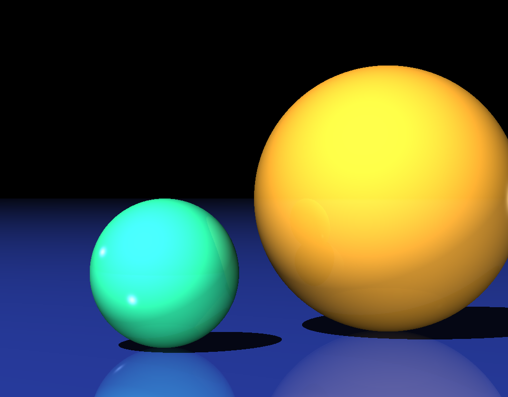
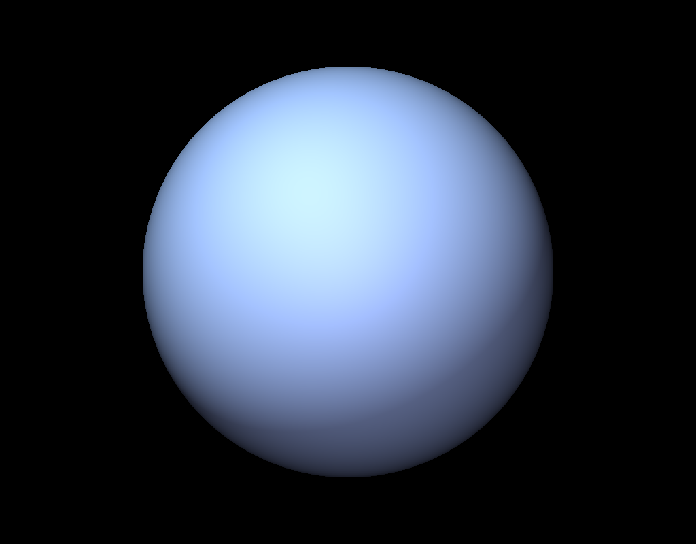
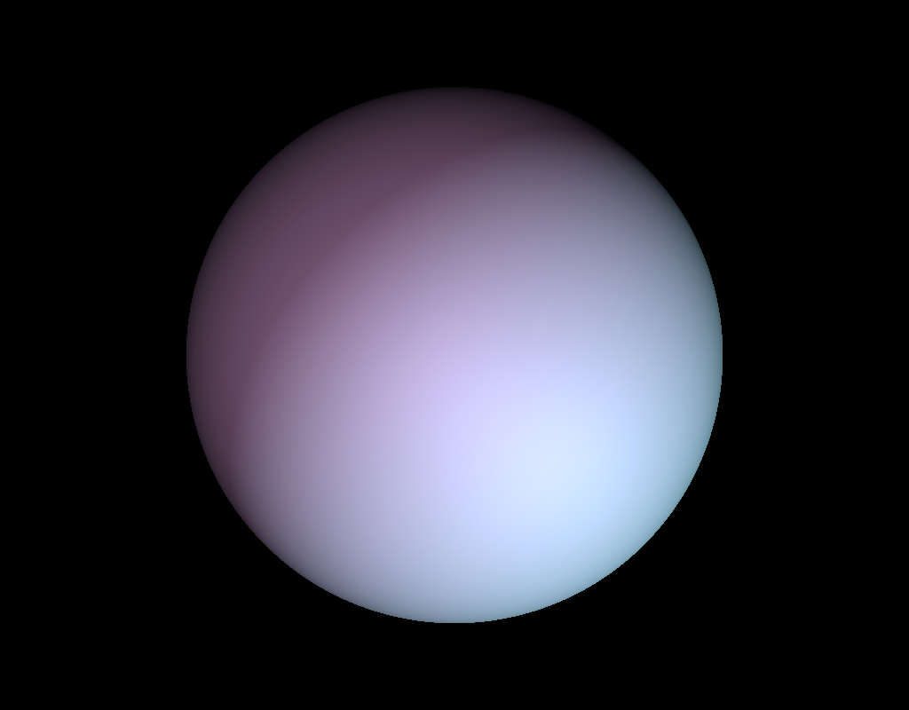

# Ray Tracer
I made a tiny ray tacer as a way to learn Rust. This ray tracer comes from the [Computer Graphics course](https://github.com/alecjacobson/computer-graphics-ray-tracing) at the University of Toronto taught by [Alec Jacobson](https://www.cs.toronto.edu/~jacobson/).

## Installation
- Clone the git repo https://github.com/ericpko/raytracer.git
- cd into the repo, then run the following commands:
- cargo build --release
- cargo run --release ./data/\<json-filename\>.json

After you execute the raytracer, you will see the images created in the `images` folder. You can also create your own JSON file and set up your own scene to render using geometric primitives such as spheres, planes, and triangles!

## Images
Here are some cool images you can create with this ray tracer!
 

 

 

 

 

 

